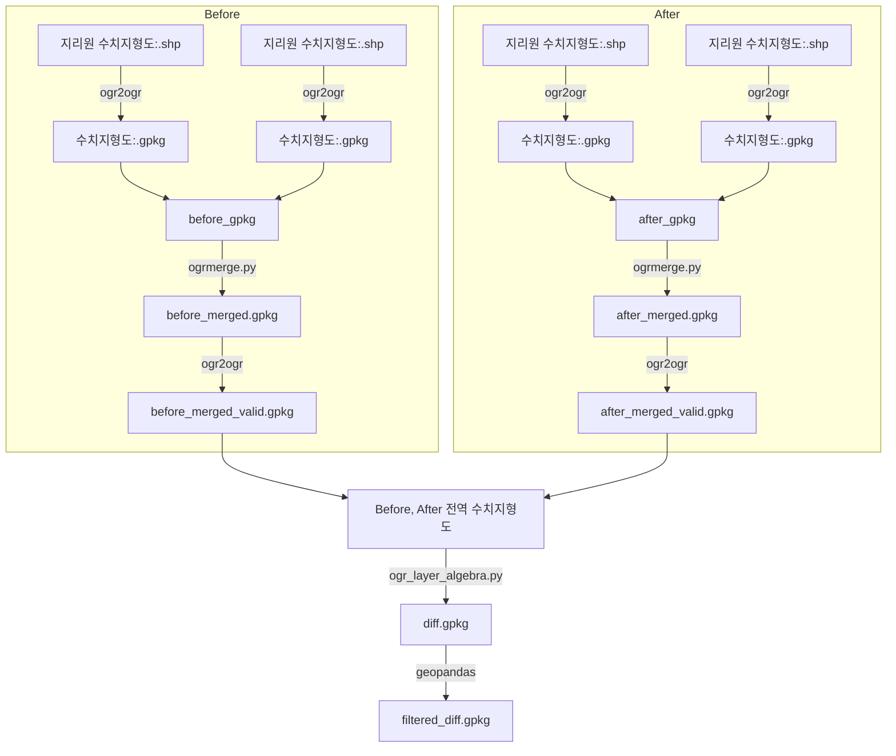

## 1. 폴더 구성 설명
```
innopam-PM2022004-digital-GT/02_Road_CD_GT
├── datasets
│   ├── 2019
│   └── 2020
├── dockerfile
├── output_sample
│   ├── after_gpkg
│   ├── after_merged.gpkg
│   ├── after_merged_valid.gpkg
│   ├── before_gpkg
│   ├── before_merged.gpkg
│   ├── before_merged_valid.gpkg
│   ├── filtered_diff_1.7.gpkg
│   ├── filtered_diff_1.8.gpkg
│   └── filtered_diff.gpkg
├── README.md
└── Road_CD_GT.py
```

#### datasets: 두 시기(2019, 2020년)에 대한 샘플 데이터셋
    - 하위에 before, after 년도에 해당하는 폴더가 두개 존재해야
    - 년도별 폴더 하위에는 각 도엽이 폴더단위로 구성되어야 함
    - 지리원에서 다운로드한 구성 그대로(.dbf, .prj, .shp, .shx)

#### dockerfile: Docker image 생성용 dockerfile

#### output_sample: 결과물 샘플
    (중간 산출물)
    - after_gpkg(폴더): datasets의 after년도 .gpkg가 저장됨
    - after_merged.gpkg: after_gpkg 폴더의 결과물 merge
    - after_merged_valid.gpkg: after_merged.gpkg의 유효한 Geometry 산출물
    - before_gpkg(폴더): datasets의 before년도 .gpkg가 저장됨
    - before_merged.gpkg: before_gpkg 폴더의 결과물 merge
    - before_merged_valid.gpkg: before_merged.gpkg의 유효한 Geometry 산출물

    (최종 산출물)
    - filtered_diff.gpkg: bufferd area ratio를 적용
    - filtered_diff_threshold.gpkg: bufferd area ratio를 적용, threshold 이하의 객체만 필터링

#### Road_CD_GT.py: 도로수치지형도 기반 변화탐지 GT 생성 코드

------
## 2. GT 생성 순서도


----
## 3. Road_CD_GT.py 사용방법
```bash
python Road_CD_GT.py \

(Required)
--shp_dir1      shp파일이 담긴 도엽폴더들의 경로(before)
--shp_dir2      shp파일이 담긴 도엽폴더들의 경로(after)
--out_dir       최종 결과물(filtered_diff.gpkg)이 저장될 경로. 경로에 "(" 혹은 ")"가 없도록 할 것
--type          수치지형도 종류(예: building, road)
--thres         ratio 기준으로 필터링할 임계값(예: 1.7)

(Optional)
--thres_end     ratio 기준으로 필터링할 임계값 중 가장 큰 값.
                thres_end 지정시, thres부터 thres_end까지 0.1씩 증가하며 결과물을 저장(예: 2.0)

```

예시코드
```bash
python Road_CD_GT.py \
--shp_dir1  datasets/2019 \
--shp_dir2  datasets/2020 \
--out_dir   output \
--type      road \
--thres     1.7 \
--thres_end 2.0 \
```
----
## 4. Docker build 방법
```bash
git clone git@github.com:innopam/innopam-PM2022004-digital-GT.git
cd 02_Road_CD_GT
docker build -t road_cd:latest .
docker run -it --name road_cd_container -v [host 경로]:[container 경로] road_cd:latest
```
docker container 내부 /workspace 에 02_Road_CD_GT 폴더의 파일이 복사됨